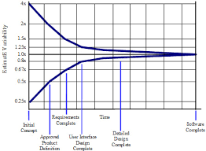

# Agile planning

<ins>*Uncertainty space diagram </ins>

* Low means uncertainty - You know how you are going to build your product.

* On an uncertainty space diagram the level of means and ends uncertainty at specific points in time for a project.

* velocity - total number of story points for user stories completed within a sprint.

* Release Planning - the user stories that should be planned first for development in a sprint are must do, high risk.

* Cone of variability illustrates that estimates need more variability early in a project.

  

* Intellectual violence can lead to group think.

* Daily monitoring can help developers stop deviating from the tasks.

* *fail fast instead of fail late*.
